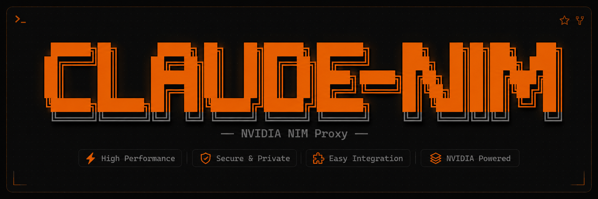
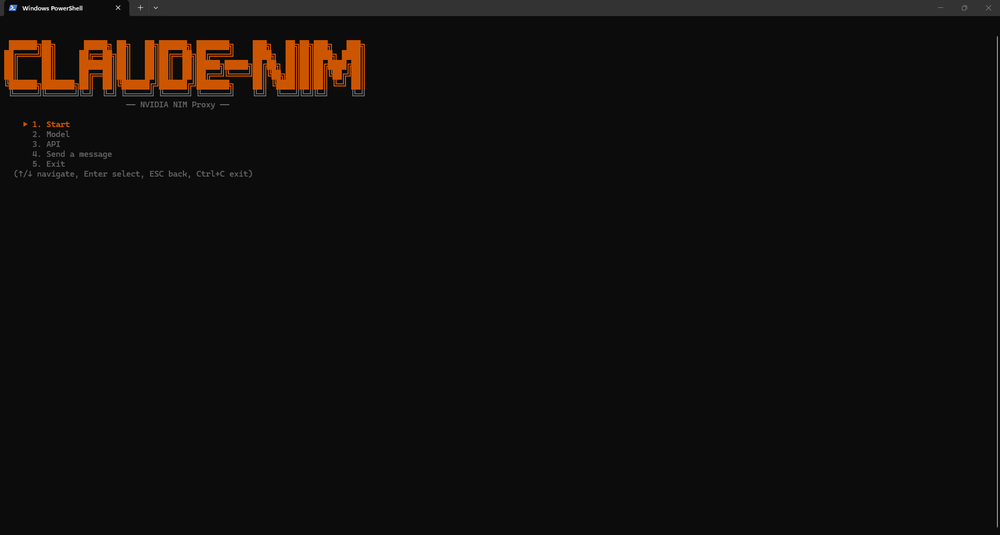
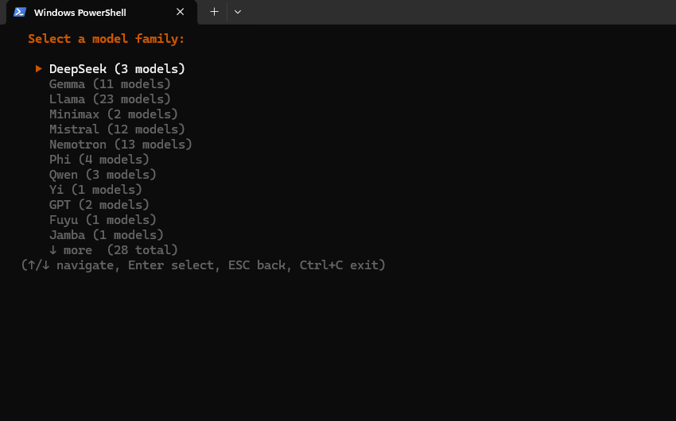
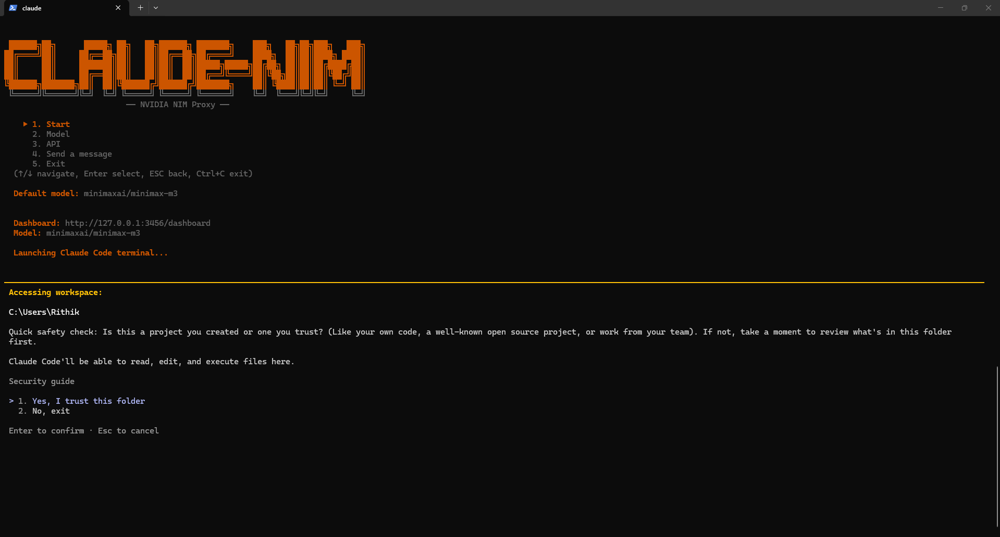
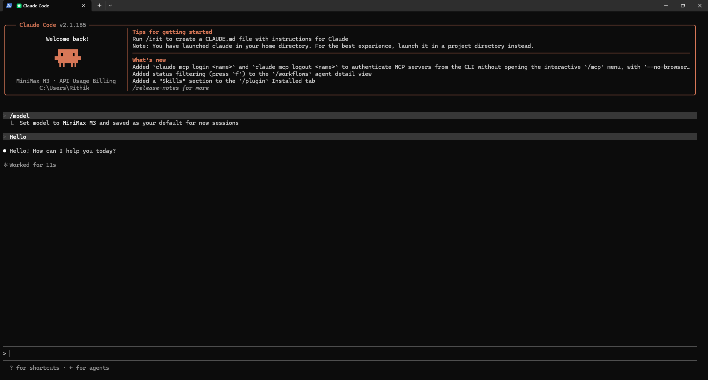
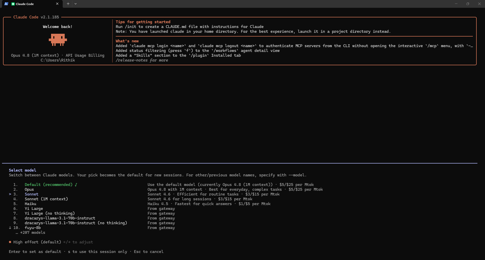

<!--
  Copyright (c) 2026 Rithika Liyanage (https://github.com/k-rithik04)
  Licensed under the MIT License - see LICENSE for details
-->

<p align="center">
  
</p>

<h1 align="center">Claude-NIM Proxy</h1>

<p align="center">
  <strong>Use 100+ NVIDIA NIM models with Claude Code</strong><br>
  Translates Anthropic API to OpenAI-compatible format — zero config changes.
</p>

<p align="center">
  <a href="https://marketplace.visualstudio.com/items?itemName=k-rithik04.claude-nim"></a>
  <a href="https://open-vsx.org/extension/k-rithik04/claude-nim"></a>
  <a href="LICENSE"></a>
  <a href="https://www.npmjs.com/package/claude-nim"></a>
  <a href="https://github.com/claude-server/claude-nim"></a>
</p>

---

### CLI Menu

<p align="center">
  
</p>

### Model Family Selection

<p align="center">
  
</p>

### Claude Code Running Through the Claude-NIM Proxy

<p align="center">
  
</p>

### Claude Code Launched via Proxy with Session Stats

<p align="center">
  
</p>

### Claude Code Native /model Picker with FCC Gateway Models

<p align="center">
  
</p>

---

---

## Requirements

- **VS Code** 1.80+
- **NVIDIA NIM API key** — free at [build.nvidia.com](https://build.nvidia.com/)
- **Claude Code CLI** — auto-installed on first use

## Quick Start

### VS Code Extension

1. Install from the [Marketplace](https://marketplace.visualstudio.com/items?itemName=k-rithik04.claude-nim) or Open VSX
2. Run `Claude NIM Proxy: Manage NVIDIA NIM API Key` to set your key
3. Run `Claude NIM Proxy: Launch Claude Code with Proxy` or press `Ctrl+Shift+Alt+N`

### CLI (npm)

```bash
# Install globally
npm install -g claude-nim

# Run
claude-nim                                # Interactive terminal UI
claude-nim --model deepseek-ai/deepseek-r1  # Explicit model
claude-nim --port 8080 --api-key nvapi-xxx  # Custom port + key
claude-nim --serve-only --port 3456        # Proxy server only (no Claude Code)
claude-nim --version                       # Show version
claude-nim --help                          # All options
```

### CLI (bunx — no install)

```bash
bunx --yes claude-nim                    # Interactive setup
bunx claude-nim --model deepseek-r1      # Explicit config
```

## How It Works

```
Claude Code  ──→  Claude-NIM Proxy  ──→  NVIDIA NIM API
(Anthropic API)   (localhost:3456)       (OpenAI-compatible)
```

1. Install the extension and set your API key
2. Start the proxy from the status bar or command palette
3. Launch Claude Code through the proxy
4. Stop the proxy — everything reverts, zero permanent changes

## Why Claude-NIM Proxy?

| | Claude-NIM Proxy | CLI Proxies | CCProxy | Claude Code Router |
|---|---|---|---|---|
| **VS Code integration** | Status bar, commands, SecretStorage, model browser | None | CLI only | None |
| **Security** | Prompt injection scrubbing, context pruning, AES-256-GCM keys | None | None | None |
| **Setup** | One command or extension install | Manual env vars + config files | Binary + config | `npm install` + `ccr start` |
| **Model routing** | Gateway IDs, 100+ NIM catalog, `/model` picker | Generic passthrough | Generic | Generic |
| **Language** | TypeScript, zero runtime deps | Python/Go | Go | Node.js + YAML |
| **Tests** | 104+ unit tests + stress tests | Minimal | None public | Minimal |
| **Live settings** | Port/timeout/cache apply without restart | Requires restart | Requires restart | Requires restart |

## Features

### Model Router & Gateway

- **Gateway model IDs** — FCC-compliant `anthropic/nvidia_nim/<modelId>` format
- **Native `/model` picker** — All NIM models appear in Claude Code's model selector
- **Real-time switching** — Change models without restarting
- **100+ models** — DeepSeek, Llama, Qwen, Mistral, Gemma, Phi, Nemotron, and more

### Full Anthropic Content Translation

| Content Type | Handling |
|---|---|
| `text` / `tool_use` / `tool_result` | Full conversion to OpenAI format |
| Image (base64) | Converted to `image_url` data URI |
| Mixed text + tools | Split into separate messages |
| `system` prompt (string/array) | Converted to system message |
| `tool_choice` (auto/any/tool) | Full mapping |

### Security

- **Prompt injection scrubbing** — Neutralizes `ignore previous instructions` patterns
- **Context pruning** — Auto-trims large tool outputs (>100K chars)
- **10 MB body limit** — Prevents memory exhaustion
- **Unicode sanitization** — Strips encoding corruption characters
- **Localhost-only binding** — Never exposed to network

### VS Code Commands

| Command | Shortcut | Description |
|---|---|---|
| Toggle Proxy Server | `Ctrl+Shift+N` | Start or stop the proxy |
| Launch Claude Code | `Ctrl+Shift+Alt+N` | Open pre-configured terminal |
| Manage API Key | — | Set, update, or clear your key |
| Select Default Model | — | Browse 100+ NIM models |
| Toggle Debug Logging | — | Enable/disable debug output |
| Toggle Show Reasoning | — | Show/hide `<think>` output |

### Configuration

| Setting | Default | Description |
|---|---|---|
| `nvidia-nim.proxyPort` | `3456` | Proxy server port |
| `nvidia-nim.defaultModel` | `""` | Default model (empty = require in request) |
| `nvidia-nim.modelsCacheTTL` | `5` | Model cache TTL in minutes |
| `nvidia-nim.requestTimeout` | `120` | Stream idle timeout in seconds |

### Dashboard

Open `http://127.0.0.1:3456/dashboard` for:

- Real-time request visualization
- Live stats (tokens, latency, throughput)
- Model browser and switcher
- Request history with filtering
- Live log stream

### API Endpoints

| Endpoint | Method | Description |
|---|---|---|
| `/api/model` | GET/POST | Get or set current model |
| `/api/models` | GET | List available NIM models |
| `/api/key` | POST | Update API key |
| `/api/metrics` | GET | SSE stream of real-time metrics |
| `/api/stats` | GET | Aggregate stats |

### Standalone CLI

```bash
claude-nim                                    # Interactive terminal UI
claude-nim --model deepseek-ai/deepseek-r1    # Explicit model
claude-nim --port 8080 --api-key nvapi-xxx    # Custom port + key
claude-nim --serve-only --port 3456            # Proxy only (no Claude Code launch)
```

Features: encrypted key storage, dynamic port selection, Claude auto-detection, zombie-free teardown. Requires [Bun](https://bun.sh) runtime.

### Error Handling

1. HTTP status mapping (401, 429, 503)
2. SSE error events in stream
3. VS Code error notifications
4. Exponential backoff retry with `Retry-After` support
5. Configurable stream idle timeout
6. 10 MB body size limit
7. JSON parse error messages with context

## Supported Models

Any model on [build.nvidia.com](https://build.nvidia.com):

DeepSeek R1/V3/V4, Llama 3.x/4.x, Mistral Large/Medium, Qwen 3/2.5, Kimi K2.x, Nemotron Ultra/Super, Gemma 3, Phi 4, Command-R+, and 100+ more.

## Build

```bash
bun install
bun run compile         # Build → out/
bun run test            # 104+ unit tests
bun run lint            # ESLint
bun run package:vsix    # Package VS Code extension
bun run build:exe:win   # Windows standalone binary
bun run build:exe:linux # Linux standalone binary
bun run build:exe:mac   # macOS standalone binary
```

## Contributing

Issues and PRs welcome at [github.com/claude-server/claude-nim](https://github.com/claude-server/claude-nim).

## License

MIT — see [LICENSE](LICENSE).

## Author

**Rithika Liyanage** — [github.com/k-rithik04](https://github.com/k-rithik04)
